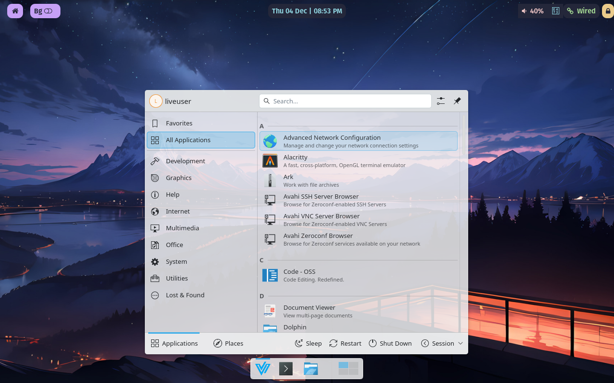

### Velocity: Fast and lightweight linux distro based on arch linux

Velocity is designed to be a fast, user friendly Linux distribution which aims to give productive users the latest software, minus all the bloat. 

DOWNLOAD VELOCITY NOW ✅:

1. [GITHUB RELEASES](https://github.com/colmehurze-tech/velocity-linux/releases) 

Features 🎉:

1. Hassle free coding with useful tools like VS code and lazyvim pre installed and pre configured. Just start the application and get going, no worries!
3. The latest and greatest zen browser is pre installed for swift, productive browsing. Based on your favourite browser firefox, this browser is has the best of all worlds!
4. Custom zsh shell and themes pre configured. Set those boring terminals aside and get a minimalistic and beautiful terminal, out of the box!
5. Tiling window manager included for maximum productivity and easy multitasking.

If you like my work, consider starring my repository. It keeps me motivated to continue building velocity ❤️

If you want to contribute to the building of velocity linux, you can email me at [this link](mailto:colmehurze@gmail.com). 

